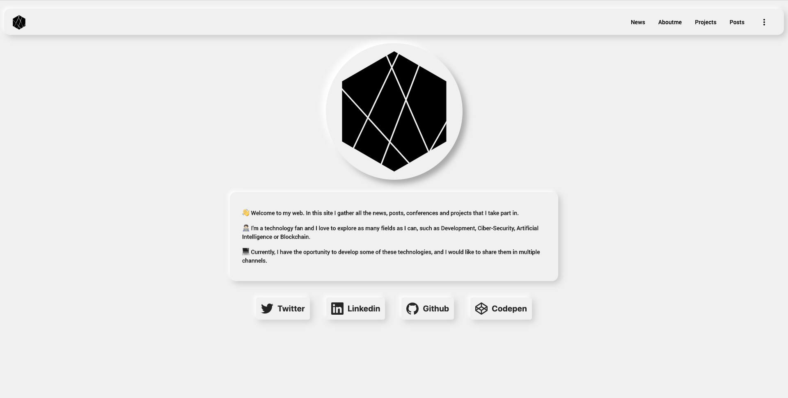

# Lucferbux Webpage
[![License][license-image]][license-url]
> My Personal Webpage

[Check the live version](https://lucferbux.dev/introduction)

## Requirements

This app runs with Angular 9+, it just need the Angular CLI and download the dependencies.

## Development server

Run `ng serve` for a dev server. Navigate to `http://localhost:4200/`. The app will automatically reload if you change any of the source files.

## Structure

### Core Module
All the components that are used across the entire app

### Shared module
Components, directives and pipes shared between multiple modules

## Feature module

This Webpage was developed in order to test my skills in Angular and some dependencies

- `@ngrx/store` - managin the state of the app, settings and dark mode
- `@ngrx/animations` - to manage the animations of the app
- `@angular/material` - material design component library, theming, ...
- `@angular/fire` - this webpage uses firebase for realtime database, storage, cloud functions and hosting
- `@angular/service-worker` - service worker for PWA capabilities
- `ngx-image-cropper` - for cropping images to upload

- routing
- testing of all the above mentioned concepts
- Angular CLI configuration (prod build, budgets, ...)

## References:

* Best practices: https://www.freecodecamp.org/news/best-practices-for-a-clean-and-performant-angular-application-288e7b39eb6f/
* Best practices 2: https://blog.usejournal.com/best-practices-for-writing-angular-6-apps-e6d3c0f6c7c1
* Good architechture: https://github.com/tomastrajan/angular-ngrx-material-starter
* Good architecture 2: https://itnext.io/choosing-a-highly-scalable-folder-structure-in-angular-d987de65ec7

## Deploy

Just run `npm run deploy` to build the Webpage

## Contribute

We would love you for the contribution to **Lucferbux Webpage**, check the ``LICENSE`` file for more info.

## Meta

Lucas Fernandez – [@lucferbux](https://twitter.com/lucferbux) – lucasfernandezaragon@gmail.com

Distributed under the MIT license. See ``LICENSE`` for more information.

[webpage-url]:https://img.shields.io/website?down_color=lightgrey&down_message=offline&up_color=blue&up_message=online&url=https%3A%2F%2Flucferbux.dev
[webpage-imagel]:https://img.shields.io/website/https/lucferbux.dev.svg

[license-image]: https://img.shields.io/badge/License-MIT-blue.svg
[license-url]: LICENSE

